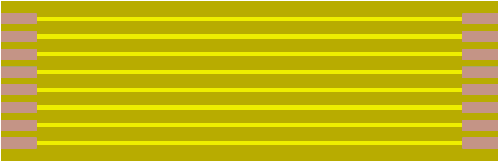

🇫🇷 **Français** | [🇬🇧 English](README.md)

# FLEX-PCB 8 pistes — pas 2.54 mm

PCB souple de raccordement entre 2 cartes par connecteur ZIF.

Nappe souple (FLEX-PCB) **8 pistes** au pas **2.54 mm** (.100"), en **simple face**,
prévue pour le connecteur **ZIF-LINE TE Connectivity 487925-1** (8 positions, traversant).

Élément de liaison réutilisable pour relier deux cartes rigides dans un boîtier
DIN, sans câblage fil à fil. Utilisée notamment par le
[kit d'affichage OLED 2 zones](https://github.com/Papymakers/heating-2z-OLED-display-board),
mais adaptable à tout montage disposant de connecteurs ZIF 8 broches au pas 2.54 mm.

## Caractéristiques

| Paramètre | Valeur |
|-----------|--------|
| Nombre de pistes | **8** |
| Pas | **2.54 mm** (.100") |
| Dimensions | **71.1 mm × 22.9 mm** |
| Construction | **Simple face** |
| Connecteur cible | TE Connectivity **487925-1** (ZIF-LINE, 8 pos., traversant) — réf. Mouser 571-487925-1 |
| Contacts | exposés en extrémité, insertion ZIF |

## Insertion

Le connecteur ZIF **487925-1** ne possède des contacts que sur une **seule
face**. Attention au sens de montage : les pistes de la nappe doivent être
orientées **côté contacts du connecteur** (face opposée au rabat / à
l'actionneur), afin que la nappe soit en contact direct sans avoir à la
plier ensuite.

Procédure : lever l'actionneur, insérer la nappe pistes vers les contacts,
puis rabaisser l'actionneur pour verrouiller. Un connecteur à chaque
extrémité permet une liaison carte-à-carte entièrement débrochable.

## Commander la nappe

Les nappes sont vendues sur [papymakers.com](https://papymakers.com).

| Option | Prix indicatif |
|--------|----------------|
| Nappe FLEX-PCB 8 pistes | **5€** |

*Frais de port inclus. Expédition depuis la France.*

## Projets liés

- [`heating-2z-OLED-display-board`](https://github.com/Papymakers/heating-2z-OLED-display-board) — kit d'affichage OLED 2 zones (utilise cette nappe)

## Licence

Documentation publiée sous licence **CC BY-SA 4.0**.

---

**Papy Makers** — [papymakers.com](https://papymakers.com) — Normandie, France
